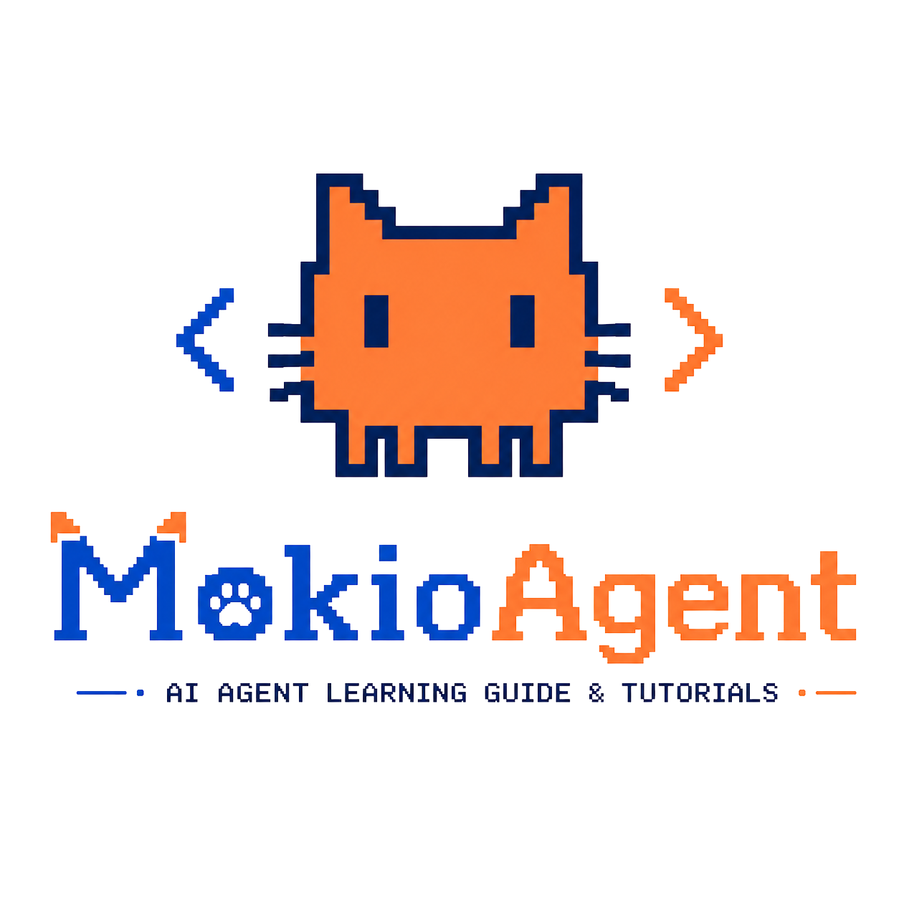

<p align="center">
  
</p>

<h1 align="center">MokioClaw</h1>

<p align="center">
  从零开始，一步步组装一个真正能做事的 Agent 系统。
</p>

## 项目主旨

MokioClaw 是一个教学优先的 Mini CodeAgent 项目。

它不是一上来就堆满复杂概念，而是沿着 Agent 系统自然生长的路径推进：

1. 先让模型学会使用 ToolCall 触碰真实文件和命令行。
2. 再让 ToolCall 长成一个可以循环观察、行动、修复的 Agent Loop。
3. 后续继续引入 Workflow、Planner、Verifier、MultiAgent、Context Engineering、Harness Engineering、Skill 和更完整的 Claw 产品壳。

当前项目的目标是把“Agent 到底怎么从聊天变成执行系统”讲清楚，让每一个阶段都能运行、能展示、能解释。

## 当前阶段

当前处于第 1 阶段：`create_agent` 基础 ReAct CodeAgent。

这一阶段使用 LangChain 的 `create_agent` 创建基础 ReAct 循环。我们不手写 LangGraph 节点，也不提前引入 Planner / Verifier，而是先把一个最小 CodeAgent 跑起来：

- 用户输入一个自然语言任务。
- Agent 决定是否调用工具。
- 工具读写文件、搜索内容、执行命令。
- Agent 根据工具结果继续下一步。
- 最后给出总结。

示例：

```bash
uv run mokioclaw "帮我创建一个简易的贪吃蛇游戏代码"
```

生成的代码和运行产物默认放在：

```text
.mokioclaw/workspace/
```

## 当前 Tool

当前 Agent 暴露了 5 个基础工具。

| Tool | 职责 | 设计重点 |
| --- | --- | --- |
| `FileReadTool` | 读取 workspace 内文本文件 | 支持 `offset` / `limit`，并记录“已读状态” |
| `FileWriteTool` | 创建文件或整文件写入 | 覆盖已有文件前要求先读，避免盲写 |
| `FileEditTool` | 对已有文件做局部替换 | 基于 `old_text` / `new_text`，要求唯一匹配 |
| `GrepTool` | 搜索 workspace 内文本内容 | 用结构化方式做内容定位，而不是让模型乱跑 shell |
| `BashTool` | 执行开发命令 | 固定在 workspace 内执行，带超时、输出截断和基础安全拦截 |

这些工具刻意参考了 Claude Code 的思路：结构化读写优先，Bash 作为受控执行层，而不是把所有事情都丢给 shell。

## 当前 Agent 架构

当前架构可以理解为一条最小 ReAct 链路：

```text
User Task
   |
   v
Typer CLI
   |
   v
RuntimeState
   |
   v
LangChain create_agent
   |
   +--> FileReadTool
   +--> FileWriteTool
   +--> FileEditTool
   +--> GrepTool
   +--> BashTool
   |
   v
Tool Observation
   |
   v
Agent Final Answer
```

几个关键点：

- `RuntimeState` 保存 workspace 和文件已读快照。
- `create_agent` 负责基础模型-工具循环。
- `Tool Registry` 负责把本地 Python 函数包装成 LangChain 工具。
- `BashTool` 默认在 `.mokioclaw/workspace/` 中执行命令。
- CLI 会流式展示模型节点、工具调用、工具结果和最终回答。

## 文件目录

当前主要目录如下：

```text
MokioAgent/
├─ logo.png
├─ README.md
├─ pyproject.toml
├─ main.py
├─ uv.lock
├─ src/
│  └─ mokioclaw/
│     ├─ __init__.py
│     ├─ __main__.py
│     ├─ cli/
│     │  ├─ app.py              # Typer CLI 入口
│     │  └─ formatter.py        # 流式事件展示
│     ├─ core/
│     │  ├─ agent.py            # create_agent 封装与运行入口
│     │  ├─ paths.py            # 项目根目录与 workspace 路径
│     │  └─ state.py            # RuntimeState 与文件快照
│     ├─ providers/
│     │  └─ openai_provider.py  # 从 .env 创建 ChatOpenAI
│     ├─ prompts/
│     │  └─ stage1.py           # 第 1 阶段系统提示词
│     └─ tools/
│        ├─ registry.py         # 工具注册
│        ├─ file_tools.py       # Read / Write / Edit
│        ├─ grep_tool.py        # 内容搜索
│        └─ bash_tool.py        # 命令执行
└─ tests/
   ├─ test_tools.py
   └─ test_cli_smoke.py
```

运行时会自动创建：

```text
.mokioclaw/
└─ workspace/
   └─ ... Agent 生成的代码和运行产物
```

`.mokioclaw/` 已加入 `.gitignore`，所以演示产物不会污染项目源码。

## 示例执行链路

假设用户输入：

```bash
uv run mokioclaw "帮我创建一个可交互计算器文件"
```

当前 Agent 的典型执行链路会是：

1. CLI 接收任务，并创建 `.mokioclaw/workspace/` 作为工作区。
2. Provider 从 `.env` 读取 `API_KEY`、`MODEL`、`BASE_URL`，创建 `ChatOpenAI`。
3. `create_agent` 接收用户任务、系统提示词和 5 个工具。
4. 模型判断需要创建代码文件，调用 `FileWriteTool`。
5. `FileWriteTool` 在 workspace 中写入类似 `calculator.py` 的文件。
6. 模型调用 `BashTool` 执行验证命令，例如：

```bash
python calculator.py --demo
```

7. 如果运行失败，模型会读取报错结果。
8. 模型可能继续调用 `FileReadTool` 查看文件内容。
9. 模型调用 `FileEditTool` 修复问题。
10. 模型再次调用 `BashTool` 验证运行结果。
11. 成功后，Agent 总结创建了什么文件、如何运行、验证结果是什么。

这就是当前阶段最重要的教学价值：

```text
自然语言任务
 -> 工具调用
 -> 文件写入
 -> 命令执行
 -> 观察错误
 -> 文件修复
 -> 再次验证
 -> 最终总结
```

也就是说，MokioClaw 现在已经不是一个只会聊天的模型，而是一个能在本地 workspace 中完成小型代码任务的基础 Agent。

## 运行方式

先在 `.env` 中配置：

```text
API_KEY=...
MODEL=...
BASE_URL=...
```

同步依赖：

```bash
uv sync
```

运行测试：

```bash
uv run pytest -q
```

运行 Agent：

```bash
uv run mokioclaw "帮我创建一个可交互计算器文件"
```
